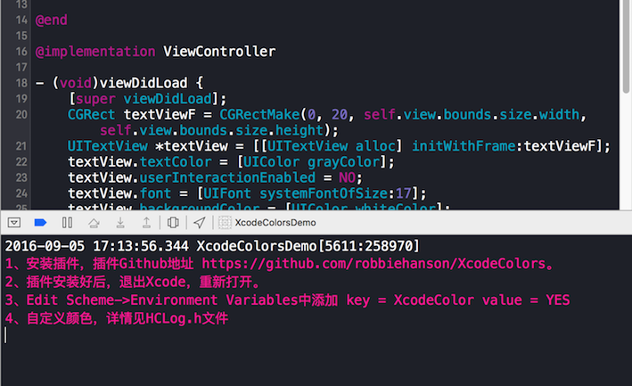

#### 控制台输出带颜色的日志

#####使用示例:
* 1、安装插件，插件Github地址 https://github.com/robbiehanson/XcodeColors。
* 2、插件安装好后，退出Xcode，重新打开。
* 3、配置环境变量。 xcode中 Edit Scheme->Environment Variables中添加 key = XcodeColor value = YES\n4、自定义颜色，详情见HCLog.h文件

